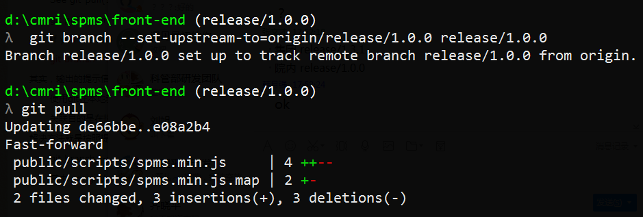

# git branch --set-upstream 本地分支关联远程分支

使用git pull的时候多次碰见下面的情况：


其实，输出的提示信息说的还是比较明白的。

使用git在本地新建一个分支后，需要做远程分支关联。如果没有关联，git会在下面的操作中提示你显示的添加关联。

关联目的是在执行git pull, git push操作时就不需要指定对应的远程分支，你只要没有显示指定，git pull的时候，就会提示你。

```bash
There is no tracking information for the current branch.
Please specify which branch you want to merge with.
See git-pull(1) for details.

    git pull <remote> <branch>

If you wish to set tracking information for this branch you can do so with:

    git branch --set-upstream-to=origin/<branch> release/1.0.0
```

解决方法就是按照提示添加一下呗：

```
git branch --set-upstream-to=origin/release/1.0.0 release/1.0.0
```

其中，`origin/release/1.0.0` 是本地分支对应的远程分支，`release/1.0.0` 当前的本地分支。



```bash
git branch --set-upstream-to=origin/release/1.0.0 release/1.0.0
```


https://www.cnblogs.com/zhou-chao/p/7678899.html